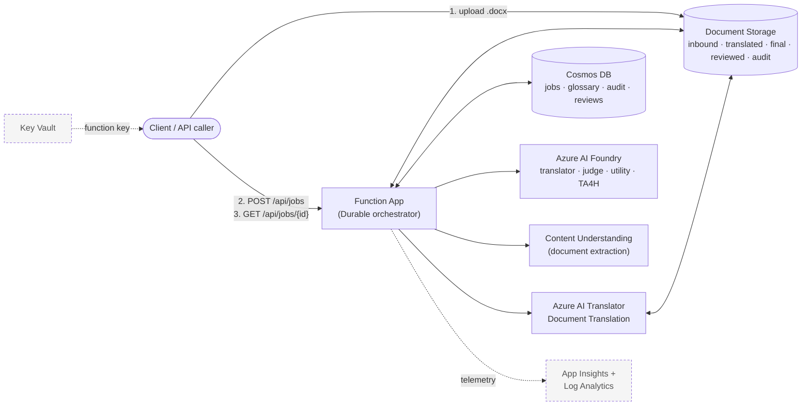
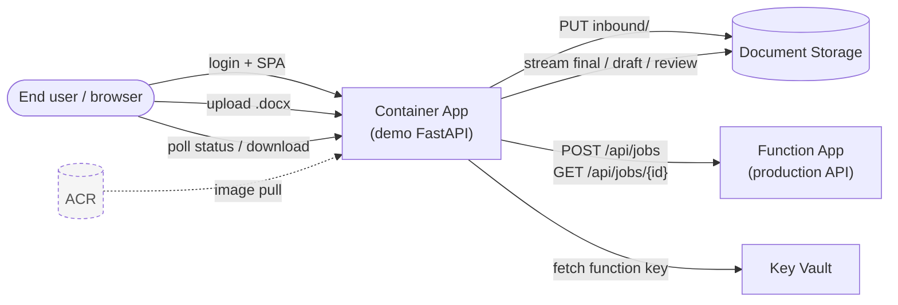
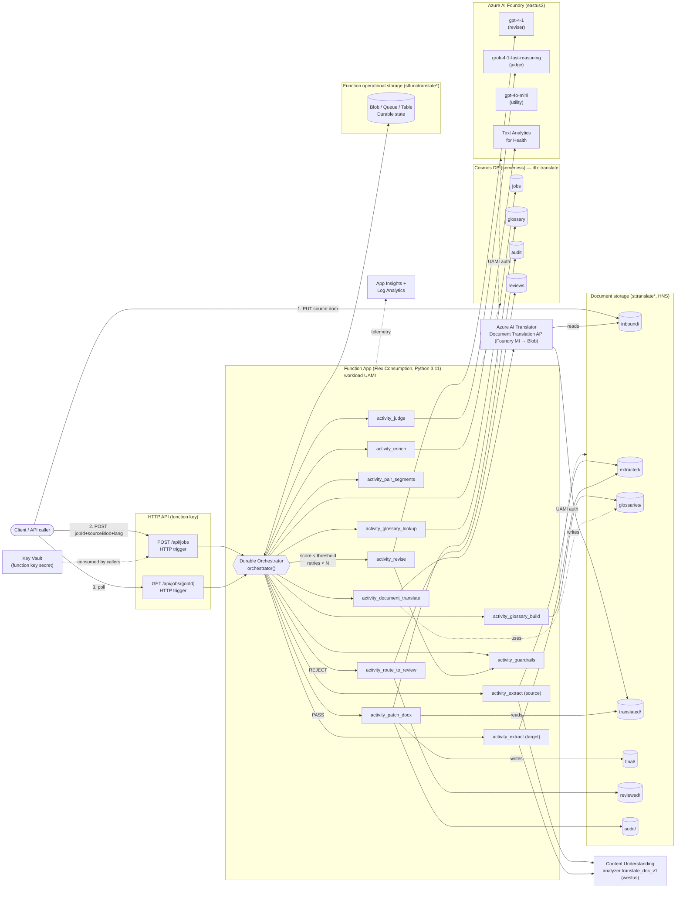
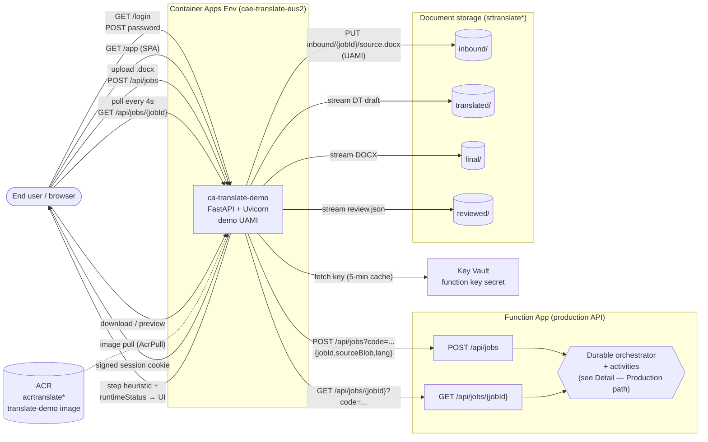

# Architecture

This document describes the architecture of the document translation system in two levels of detail:

1. **Overview** — high-level diagrams where each Azure service is a single box. Good for explaining the system at a glance.
2. **Detail** — full diagrams showing the Durable Functions activities, storage containers, Cosmos containers, and model deployments. Good for engineering reviews and debugging.

Each level has two diagrams: the **production Function API path** (the contract a real caller integrates against) and the **demo app overlay** (a FastAPI Container App that consumes the production API).

---

## Overview — Production path

The production surface is the Function App's HTTP API. A caller uploads a source `.docx` to the document storage `inbound/` container, then POSTs a job request to the Function App. The Function App's Durable orchestrator drives Content Understanding, Azure AI Translator (Document Translation), and Azure AI Foundry models, persisting state to Cosmos DB and final output to storage.

---

## Overview — Demo overlay

The demo is a FastAPI Container App that sits in front of the production Function API. End users authenticate against the demo (password + signed cookie), upload a `.docx`, and the demo brokers the upload-to-storage + start-job + poll-status flow on their behalf. The Function App is a black box to the demo.

---

## Detail — Production path

Full Durable Functions activity graph. The orchestrator extracts the source via Content Understanding, enriches with Text Analytics for Health, looks up pinned glossary terms in Cosmos, builds a TSV glossary blob, runs Azure AI Translator Document Translation (format-preserving spine), re-extracts the translated output, pairs segments by reading order, runs deterministic guardrails, then scores with the Grok judge. On `REVISE`, only flagged segments are sent to the GPT-4.1 reviser and the loop re-runs guardrails + judge (up to `MAX_REVISE_ATTEMPTS`). On `PASS`, the orchestrator surgically patches only the revised segments into the Document Translation output and writes the final DOCX. On `REJECT` after retries, the job is routed to human review.

---

## Detail — Demo overlay

The demo is a single FastAPI process in a Container App. It handles password login (signed cookie session), uploads to `inbound/` using its own UAMI, fetches the Function key from Key Vault (5-minute cache), then proxies `POST /api/jobs` and `GET /api/jobs/{id}` calls. The browser polls the demo every 4 seconds, and the demo overlays a time-based step heuristic on top of the orchestrator's `runtimeStatus`. Downloads and previews stream directly from document storage. The orchestrator details from the production diagram are intentionally shown as a black box here.

